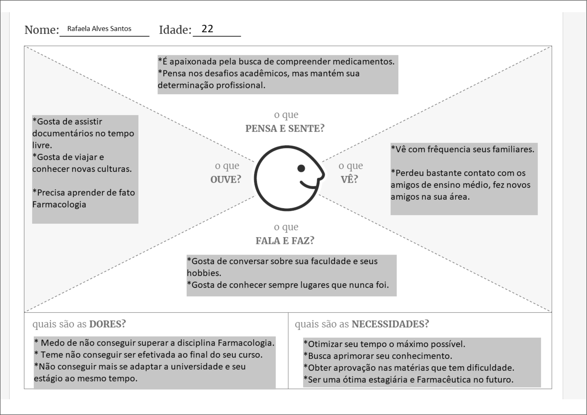

# Informações do Projeto 

DESENVOLVIMENTO DE UM SOFTWARE WEB PARA GERENCIAMENTO DE MENTORIAS DA PUC MINAS

Faculdades: Sistemas de Informação e Análise e Desenvolvimento de Sistemas

## Participantes

Desenvolvedores: 

Adenilson Rodrigues Cordeiro Junior

Arthur Alves Oliveira Silva

Alessandro Gomes Pereira

Marlon Magalhaes Carvalho

Samuel Correia Nunes

# Estrutura do Documento

- [Informações do Projeto](#informações-do-projeto)
  - [Participantes](#participantes)
- [Estrutura do Documento](#estrutura-do-documento)
- [Introdução](#introdução)
  - [Problema](#problema)
  - [Objetivos](#objetivos)
  - [Justificativa](#justificativa)
  - [Público-Alvo](#público-alvo)
- [Especificações do Projeto](#especificações-do-projeto)
  - [Personas e Mapas de Empatia](#personas-e-mapas-de-empatia)
  - [Histórias de Usuários](#histórias-de-usuários)
  - [Requisitos](#requisitos)
    - [Requisitos Funcionais](#requisitos-funcionais)
    - [Requisitos não Funcionais](#requisitos-não-funcionais)
  - [Restrições](#restrições)
- [Projeto de Interface](#projeto-de-interface)
  - [User Flow](#user-flow)
  - [Wireframes](#wireframes)
- [Metodologia](#metodologia)
  - [Divisão de Papéis](#divisão-de-papéis)
  - [Ferramentas](#ferramentas)
  - [Controle de Versão](#controle-de-versão)
- [**############## SPRINT 1 ACABA AQUI #############**](#-sprint-1-acaba-aqui-)
- [Projeto da Solução](#projeto-da-solução)
  - [Tecnologias Utilizadas](#tecnologias-utilizadas)
  - [Arquitetura da solução](#arquitetura-da-solução)
- [Avaliação da Aplicação](#avaliação-da-aplicação)
  - [Plano de Testes](#plano-de-testes)
  - [Ferramentas de Testes (Opcional)](#ferramentas-de-testes-opcional)
  - [Registros de Testes](#registros-de-testes)
- [Referências](#referências)

# Introdução

## Problema
  Para muitos estudantes, a busca por orientação ou mentoria pode ser dificultada por equívocos e desafios significativos. Algumas pessoas encaram essa busca como um sinal de vulnerabilidade ou falta de competência, o que acaba por desencorajá-las a procurar mentores. Além disso, estudantes universitários frequentemente enfrentam uma carga horária intensa, equilibrando aulas e trabalho, o que gera uma sensação de sobrecarga e falta de tempo para se envolver na busca por um mentor. A dificuldade em coordenar agendas também é um obstáculo adicional, especialmente quando os mentores em potencial também estão sobrecarregados com suas próprias obrigações acadêmicas e profissionais.

  Nesse cenário desafiador, a sincronização das agendas dos alunos com as dos mentores torna-se uma tarefa complicada, frequentemente desencorajando a busca por mentoria. No entanto, é importante reconhecer que esses obstáculos não deveriam impedir os estudantes de buscar orientação. Apesar das dificuldades, os benefícios que a mentoria pode oferecer em suas jornadas acadêmicas e profissionais são imensuráveis. Portanto, é fundamental superar esses desafios, procurando ativamente mentores que possam oferecer orientação valiosa.

## Objetivos

Desenvolver um software web voltado para a gestão do processo de aprendizado entre mentores e mentorados, com foco na facilitação da comunicação entre ambas as partes, incluindo a seleção do mentor e a definição dos tópicos a serem abordados durante a mentoria.

Objetivos Específicos:
Este projeto se propõe a alcançar os seguintes objetivos:

- Realizar uma pesquisa preliminar para identificar e definir os desafios associados ao processo de mentoria.
- Conduzir uma análise detalhada da documentação de requisitos, visando a identificação dos elementos cruciais para a criação do software.
- Criar uma aplicação web que permita a marcação e administração de sessões de mentoria por meio de módulos e funcionalidades específicas.
- Utilizar técnicas de desenvolvimento web para a construção da interface e layout da plataforma, garantindo também a implementação das funcionalidades necessárias.

Deste modo, nosso objetivo é desenvolver um software web que facilite eficazmente a gestão do processo de mentoria, promovendo a interação entre mentor e mentorado, ao mesmo tempo em que simplifica a escolha do mentor e a definição dos temas a serem abordados durante as sessões.

## Justificativa

  O software Mentoria foi concebido com o propósito fundamental de revolucionar a interação entre os alunos e monitores da PUC Minas, com o objetivo primordial de simplificar e aprimorar substancialmente o canal de comunicação entre esses dois grupos, visando proporcionar uma experiência global aprimorada. Apesar de a plataforma CANVAS já oferecer a funcionalidade de mentoria, o atual modelo não está plenamente alinhado com as necessidades dos usuários que buscam especificamente esse tipo de interação. Nesse contexto, essa questão adquire grande relevância, especialmente para os alunos ingressantes da universidade, que frequentemente não estão familiarizados com o funcionamento detalhado do CANVAS e do SGA, o que resulta em desconhecimento e limitações na sua utilização eficiente.

  A implementação dessas melhorias não apenas beneficiará os alunos, proporcionando-lhes uma experiência mais suave e produtiva, mas também terá impactos positivos significativos para os monitores, contribuindo para a otimização e aprimoramento da eficácia do processo para todas as partes envolvidas permitindo a ambos novas funcionalidades para a melhor condução do processo de mentoria.

## Público-Alvo

O software web de mentorias para instituições educacionais atende a diversos públicos, incluindo:

- Professores e Orientadores: Utilizam a plataforma para fornecer suporte acadêmico e orientação aos estudantes.
- Alunos: Acessam a ferramenta para aprimorar seu desempenho acadêmico e planejar suas sessões de mentoria.
- Coordenadores Educacionais: Responsáveis pela supervisão de diversas atividades, incluindo as mentorias, contam com o software para gerenciar esses processos de forma eficiente.
- Administração Escolar: Os membros da equipe administrativa utilizam a plataforma para garantir o funcionamento adequado de todas as operações relacionadas às mentorias e à gestão geral da instituição.
 
# Especificações do Projeto

## Personas e Mapas de Empatia

## Histórias de Usuários
--------------------------------------------------------------------------------------------------------------------
Maria Gabriela Amorim é estudante do curso de Psicologia na PUC Minas e leva uma vida extremamente ocupada. Ela enfrenta desafios consideráveis na tentativa de equilibrar seus horários de estudo com seus compromissos pessoais e profissionais. Durante nossa entrevista, ela destacou a dificuldade que enfrenta ao buscar suporte para as disciplinas em que encontra obstáculos. Isso ocorre, em grande parte, devido à maioria das sessões de monitoria ocorrerem durante as tardes e, frequentemente, de forma presencial. No entanto, devido à sua residência distante e ao seu estágio em uma grande empresa, Gabriela não tem a flexibilidade de comparecer a essas mentorias.
Ela está ansiosa por uma solução que lhe permita harmonizar sua agenda com a disponibilidade das mentorias de forma híbrida, o que significa que ela gostaria de poder escolher entre participar presencialmente em alguns dias e remotamente em outros, conforme sua situação e necessidades específicas.

--------------------------------------------------------------------------------------------------------------------
Mateus Júnior Prado é um estudante dedicado do curso de Sistemas de Informação na PUC Minas. Desde o início de sua jornada acadêmica, ele traçou com clareza seus objetivos: tornar-se um programador habilidoso e, eventualmente, alcançar o sucesso como desenvolvedor de software. No entanto, Mateus compreendia que a estrada para atingir esses objetivos seria longa e repleta de desafios. Um dos obstáculos que ele enfrentou desde o início de sua trajetória foi a necessidade de orientação e mentoria.
Ele reconhecia a importância de aprender com aqueles que já trilharam o caminho que ele desejava seguir, mas deparava-se com a constante dificuldade de encontrar mentores e agendar sessões de mentoria que se encaixassem em sua agenda lotada de aulas e projetos. Determinado a superar esse obstáculo, Mateus começou a buscar métodos ágeis e flexíveis para programar e realizar suas mentorias. Ele percebeu que o mundo digital oferece uma infinidade de soluções e estava decidido a aproveitar ao máximo esses recursos.

--------------------------------------------------------------------------------------------------------------------
Rafaela Alves Santos é estudante do curso de Farmácia na PUC Minas. Ela tem a necessidade de entrar em contato com a monitoria da universidade de maneira ágil e eficiente. Seu objetivo é escolher as disciplinas que requerem sua maior atenção. Essa busca por agilidade e facilidade no acesso ao sistema de monitoria tem como finalidade principal auxiliá-la nos estudos das matérias em que enfrenta maiores dificuldades. Ela tem o desejo em economizar tempo e melhorar seu desempenho acadêmico, aproveitando da oportunidade para esclarecer dúvidas com os monitores, tornando seu processo de aprendizado mais eficaz.

--------------------------------------------------------------------------------------------------------------------

Com base nas análises das personas e nos mapas de empatia, foram identificados os seguintes pontos a serem desenvolvidos:

|MARIA GABRIELA      | QUERO/PRECISO                            |PARA                                                  |
|--------------------|------------------------------------------|------------------------------------------------------|
|Usuário do sistema  | Agendar as mentorias                     | Conciliar as agendas                                 |
|Usuário do sistema  | Mentorias na modalidade Remota/Presencial| Flexibilidade de atendimento                         |

|MATEUS JUNIOR       | QUERO/PRECISO                            |PARA                                                  |
|--------------------|------------------------------------------|------------------------------------------------------|
|Usuário do sistema  | Agendar as mentorias                     | Conciliar as agendas                                 |
|Usuário do sistema  | Mentorias na modalidade Remota/Presencial| Flexibilidade de atendimento                         |
|Usuário do sistema  | Sistema de Feedback                      | Criticas em relação as disponibilidades dos mentores |

|RAFAELA ALVES       | QUERO/PRECISO                            |PARA                                                  |
|--------------------|------------------------------------------|------------------------------------------------------|
|Usuário do sistema  | Agendar as mentorias                     | Conciliar as agendas                                 |
|Usuário do sistema  | Comunicar com o mentor                   | Sanar duvidas                                        |
|Usuário do sistema  | Mentorias na modalidade Remota/Presencial| Flexibilidade de atendimento                         |
|Usuário do sistema  | Sistema de Feedback                      | Criticas em relação as disponibilidades dos mentores |
|Usuário do sistema  | Suporte ao Sistema                       | Auxiliar na utilização do novo sistema               |

## Requisitos

As tabelas subsequentes exibem os requisitos funcionais e não funcionais que proporcionam uma descrição detalhada do escopo do projeto.

### Requisitos Funcionais

|ID    | Descrição do Requisito  | Prioridade |
|------|-----------------------------------------|----|
|RF-001| O sistema deve permitir o cadastro de alunos e monitores | ALTA |
|RF-002| Permitir o cadastro das disciplinas  | ALTA |
|RF-003| Disponibilizar agenda para marcação de horários com mentores | ALTA |
|RF-004| Sistema de Mensagem para comunicação entre Mentor e Aluno | ALTA |
|RF-005| O sistema deve permitir a entrada por Login e Senha | ALTA |
|RF-006| Compartilhamento de Recursos e Matérias Complementares | MÉDIO |
|RF-007| Avaliação / Feedback dos atendimentos | BAIXO |

### Requisitos não Funcionais

|ID     | Descrição do Requisito  |Prioridade |
|-------|-------------------------|----|
|RNF-001| O sistema deve ser capaz de ser escalavel | ALTA | 
|RNF-002| O sistema deve possuir medidas de segurança visando a privacidade dos dados  | ALTA | 
|RNF-003| O sistema deve ser robusto o suficiente para suportar simultaneamente múltiplos usuários.| ALTA | 
|RNF-004| O sistema deve ser responsivo para rodar em um dispositivos móvel  | MÉDIA | 
|RNF-005| O sistema deve possuir Backup planejado dos dados  | MÉDIA | 
|RNF-006| O sistema deve possuir suporte tecnico quando necessario | MÉDIA | 
|RNF-007| O sistema deve estar disponível 99,9% do tempo, sem interrupções, excluindo janelas de manutenção planejada. | BAIXO | 

## Restrições

O projeto está limitado pelos elementos apresentados na tabela a seguir.

|ID| Restrição                                             |
|--|-------------------------------------------------------|
|01| O sistema web será desenvolvido visando apenas desktops.|
|02| O projeto deverá ser concluído até o final do semestre letivo.|
|03| O projeto possui 3 desenvolvedores.|
|04| Restrições orçamentárias e financeiras.|
|05| O sistema deverá ser desenvolvido em JavaScript.|
|06| O sistema deve ser desenvolvido em língua portuguesa.|

# Projeto de Interface

Estas soluções foram minuciosamente planejadas com o objetivo de proporcionar uma experiência completa e eficaz aos usuários. Um elemento essencial do nosso site será a incorporação de um sistema de mensagem que permitirá a interação direta entre os usuários e os mentores. Isso simplificará a troca eficaz de informações e experiências, possibilitando que os usuários esclareçam dúvidas, recebam orientações e estabeleçam conexões mais próximas com os mentores, enriquecendo assim o processo de mentoria.

Ademais, o site incluirá uma funcionalidade de agendamento que permitirá aos mentores marcar sessões de mentoria de acordo com sua disponibilidade. Essa funcionalidade aprimorará a gestão do tempo, assegurando uma organização eficiente das agendas e proporcionando transparência na disponibilidade dos mentores.

Um recurso valioso será a integração de um fórum no site, onde os usuários poderão compartilhar suas experiências, fazer perguntas e colaborar uns com os outros. Esse espaço comunitário promoverá a colaboração e a troca de conhecimento entre os usuários, enriquecendo ainda mais a experiência educacional.

Por fim, nosso site incluirá uma aba dedicada à inclusão de listas de atividades, vídeos e materiais complementares disponibilizados pelos mentores. Além disso, o site também contará com uma página dedicada ao feedback. Isso permitirá que os usuários realizem tarefas e avaliem tanto os mentores quanto o conteúdo disponibilizado. Essa abordagem não apenas incentivará a participação ativa, mas também possibilitará o aprimoramento contínuo do programa de mentoria com base nos comentários dos usuários.

## User Flow

## Wireframes

# Metodologia

A metodologia adotada pelo nosso grupo para o desenvolvimento deste projeto baseou-se nas práticas ágeis, uma abordagem que valoriza a flexibilidade, a colaboração e a entrega contínua. Optamos por utilizar o Scrum, um dos métodos ágeis mais reconhecidos, para guiar nosso processo de trabalho. 
A metodologia enfatiza a entrega incremental, permitindo que as funcionalidades do projeto sejam desenvolvidas e disponibilizadas em ciclos curtos, conhecidos como sprints. Cada sprint teve uma duração fixa, proporcionando oportunidades frequentes de revisão e adaptação do trabalho realizado. 
Para facilitar a comunicação e colaboração, utilizamos ferramentas colaborativas, como o discord para comunicação em tempo real e o Trello para gerenciar as tarefas em um formato visual e interativo. Essas ferramentas foram essenciais para manter todos os membros da equipe alinhados com os objetivos e progressos do projeto. 

## Divisão de Papéis

Adenilson: Tarefas: Alinhou cards do Painel de Controle,
Deixou todas as imagens da capa de album com o mesmo tamanho,
Reduziu e otimizar os nomes das páginas do projetos,
Melhorou a Estilização da Página de Conteúdo com Ícones e Fontes.
Desenvolveu um Novo Painel do Monitor no Estilo de Postagem de Blog,
Desenvolveu um botão que fica visivel somente ao Monitor/Professor para apagar o conteudo postado da semana e outro botão que permita editar, etc.

Alessandro: Tarefas: Adicionou os Novos Inputs da Página Calendário ao Calendário, 
Desenvolveu Botão para Envio de Imagem da Capa dos Cards/Configuração
Adicionou botão Light/Dark na agenda.
Colocou calendario dentro de um container Bootstrap para responsividade.
Limpou o codigo da página que desenvolveu, etc.

Arthur: Tarefas: Verificação de Responsividade da Tela Desenvolvida, 
Corrigiu o Botão Voltar na Página dos Conteúdos das Disciplinas,
Verificou se todas as páginas estão linkadas de forma correta,
Melhorou e corrigiu o conteúdo das páginas. Exemplo: remover em ajuda informações sobre feedback,
Corrigiu os nomes e emails das pessoas na pagina de pessoas,
Corrigiu a pagina de ajuda com um link para os contatos da PUC, etc.

Marlon: Tarefas:  Vinculou no código a imagem do "Fale com a PUC Minas" com o site da PUC Minas Oficial.
Desenvolveu Página de Caixa de Saída, 
Desenvolveu Página de Importantes,
Desenvolveu Página de Lixeira,
Verificou se todas as páginas estão linkadas de forma correta. E fez a correção.
Realizou a revisão geral do trabalho. Verificar responsividade, conexões, links, comunicação, github etc
Supervisionou a equipe com relação as entragas na data marcada, etc.

Samuel: Tarefas: Desenvolveu botão "Sair" para todas as paginas,
Colocou ícones na página ajuda em cada opção,
Verificou a responsividade do Menu lateral das páginas,
Limpou o codigo das páginas,
Desenvolveu página do mentor,
Desenvolveu barra lateral,
Coordenou a equipe em direção as metas e sprints,
Foi responsável por corrigir erros, códigos, documentos e tudo que envolve o trabalho em cada sprint.

Em resumo, Cada membro do grupo fez um pouco de tudo em cada sprint (estilização, alinhamento, responsividade, etc). 

## Ferramentas

No processo de desenvolvimento de um software web voltado para a gestão de processo de aprendizado entre mentores e mentorados, diversas ferramentas desempenharam papéis cruciais. Cada uma delas contribuiu para diferentes aspectos do ciclo de vida do software, desde o planejamento até a entrega final. Abaixo, destacamos as principais ferramentas utilizadas e suas respectivas usabilidades e vantagens:

Trello - Controle de Demandas e Gerenciamento de Projeto:

O Trello é uma ferramenta de gerenciamento de projetos baseada em quadros, listas e cartões. Cada cartão representa uma tarefa ou demanda, e as listas organizam essas tarefas em diferentes estágios do projeto, isso facilita a visualização do fluxo de trabalho, permite atribuir responsabilidades a membros da equipe, acompanhar o progresso em tempo real e identificar possíveis gargalos. Além disso, sua interface intuitiva promove a colaboração eficiente entre os membros da equipe.

VSCode - Desenvolvimento de HTML5, CSS e JS (JavaScript):

Visual Studio Code (VSCode) é um ambiente de des’envolvimento integrado leve e poderoso. Suporta uma ampla gama de linguagens de programação, oferecendo recursos avançados como realce de sintaxe, depuração e controle de versão integrado. A eficiência do VSCode reside na sua extensibilidade e na integração perfeita com ferramentas populares. Oferece sugestões inteligentes de código, facilita a navegação no projeto e proporciona uma experiência de desenvolvimento fluida.

Discord - Reuniões de Alinhamento:

Discord é uma plataforma de comunicação por voz, vídeo e texto. Foi utilizado para reuniões de alinhamento entre os membros da equipe, proporcionando uma comunicação rápida e eficaz. Foram realizadas reuniões síncronas, promovendo a interação instantânea entre os membros da equipe, facilita a comunicação informal e oferece recursos como compartilhamento de tela para apresentações mais claras.

GitHub - Controle de versão do software e repositório de documentação:

GitHub é uma plataforma de hospedagem de código-fonte que utiliza o sistema de controle de versão Git. Ele fornece um ambiente colaborativo para desenvolvedores compartilharem, colaborarem e controlarem as alterações em seu código. O repositório oferece um histórico detalhado de alterações no código, facilita a colaboração simultânea de várias equipes, fornece recursos de rastreamento de problemas (issues) e permite a integração contínua para garantir uma entrega contínua e estável.
Em conjunto, essas ferramentas criaram um ambiente de desenvolvimento integrado e colaborativo. O Trello ajudou na organização das tarefas, o VSCode facilitou o desenvolvimento do código, o Discord promoveu a comunicação eficiente, e o GitHub garantiu o controle de versão e a gestão centralizada do código-fonte.

| Ambiente  | Plataforma              |Link de Acesso |
|-----------|-------------------------|---------------|
|Gerenciamento de projeto  | Trello |  https://trello.com/ | 
|Repositório de código | GitHub | https://gist.github.com/ | 
|Ambiente de desenvolvimento | VScode |  https://code.visualstudio.com/ | 
|Reuniões de alinhamento | Discord | https://discord.com/ | 

## Controle de Versão

......  COLOQUE AQUI O SEU TEXTO ......

> Discuta como a configuração do projeto foi feita na ferramenta de
> versionamento escolhida. Exponha como a gerência de tags, merges,
> commits e branchs é realizada. Discuta como a gerência de issues foi
> realizada.
> A ferramenta de controle de versão adotada no projeto foi o
> [Git](https://git-scm.com/), sendo que o [Github](https://github.com)
> foi utilizado para hospedagem do repositório `upstream`.
> 
> O projeto segue a seguinte convenção para o nome de branchs:
> 
> - `master`: versão estável já testada do software
> - `unstable`: versão já testada do software, porém instável
> - `testing`: versão em testes do software
> - `dev`: versão de desenvolvimento do software
> 
> Quanto à gerência de issues, o projeto adota a seguinte convenção para
> etiquetas:
> 
> - `bugfix`: uma funcionalidade encontra-se com problemas
> - `enhancement`: uma funcionalidade precisa ser melhorada
> - `feature`: uma nova funcionalidade precisa ser introduzida
>
> **Links Úteis**:
> - [Tutorial GitHub](https://guides.github.com/activities/hello-world/)
> - [Git e Github](https://www.youtube.com/playlist?list=PLHz_AreHm4dm7ZULPAmadvNhH6vk9oNZA)
> - [5 Git Workflows & Branching Strategy to deliver better code](https://zepel.io/blog/5-git-workflows-to-improve-development/)
>
> **Exemplo - GitHub Feature Branch Workflow**:
>
> 

# **############## SPRINT 1 ACABA AQUI #############**

# Projeto da Solução

......  COLOQUE AQUI O SEU TEXTO ......

## Tecnologias Utilizadas

......  COLOQUE AQUI O SEU TEXTO ......

> Descreva aqui qual(is) tecnologias você vai usar para resolver o seu
> problema, ou seja, implementar a sua solução. Liste todas as
> tecnologias envolvidas, linguagens a serem utilizadas, serviços web,
> frameworks, bibliotecas, IDEs de desenvolvimento, e ferramentas.
> Apresente também uma figura explicando como as tecnologias estão
> relacionadas ou como uma interação do usuário com o sistema vai ser
> conduzida, por onde ela passa até retornar uma resposta ao usuário.
> 
> Inclua os diagramas de User Flow, esboços criados pelo grupo
> (stoyboards), além dos protótipos de telas (wireframes). Descreva cada
> item textualmente comentando e complementando o que está apresentado
> nas imagens.

## Arquitetura da solução

......  COLOQUE AQUI O SEU TEXTO E O DIAGRAMA DE ARQUITETURA .......

> Inclua um diagrama da solução e descreva os módulos e as tecnologias
> que fazem parte da solução. Discorra sobre o diagrama.
> 
> **Exemplo do diagrama de Arquitetura**:
> 
> 

# Avaliação da Aplicação

......  COLOQUE AQUI O SEU TEXTO ......

> Apresente os cenários de testes utilizados na realização dos testes da
> sua aplicação. Escolha cenários de testes que demonstrem os requisitos
> sendo satisfeitos.

## Plano de Testes

......  COLOQUE AQUI O SEU TEXTO ......

> Enumere quais cenários de testes foram selecionados para teste. Neste
> tópico o grupo deve detalhar quais funcionalidades avaliadas, o grupo
> de usuários que foi escolhido para participar do teste e as
> ferramentas utilizadas.
> 
> **Links Úteis**:
> - [IBM - Criação e Geração de Planos de Teste](https://www.ibm.com/developerworks/br/local/rational/criacao_geracao_planos_testes_software/index.html)
> - [Práticas e Técnicas de Testes Ágeis](http://assiste.serpro.gov.br/serproagil/Apresenta/slides.pdf)
> -  [Teste de Software: Conceitos e tipos de testes](https://blog.onedaytesting.com.br/teste-de-software/)

## Ferramentas de Testes (Opcional)

......  COLOQUE AQUI O SEU TEXTO ......

> Comente sobre as ferramentas de testes utilizadas.
> 
> **Links Úteis**:
> - [Ferramentas de Test para Java Script](https://geekflare.com/javascript-unit-testing/)
> - [UX Tools](https://uxdesign.cc/ux-user-research-and-user-testing-tools-2d339d379dc7)

## Registros de Testes

......  COLOQUE AQUI O SEU TEXTO ......

> Discorra sobre os resultados do teste. Ressaltando pontos fortes e
> fracos identificados na solução. Comente como o grupo pretende atacar
> esses pontos nas próximas iterações. Apresente as falhas detectadas e
> as melhorias geradas a partir dos resultados obtidos nos testes.

# Referências

......  COLOQUE AQUI O SEU TEXTO ......

> Inclua todas as referências (livros, artigos, sites, etc) utilizados
> no desenvolvimento do trabalho.
> 
> **Links Úteis**:
> - [Formato ABNT](https://www.normastecnicas.com/abnt/trabalhos-academicos/referencias/)
> - [Referências Bibliográficas da ABNT](https://comunidade.rockcontent.com/referencia-bibliografica-abnt/)
