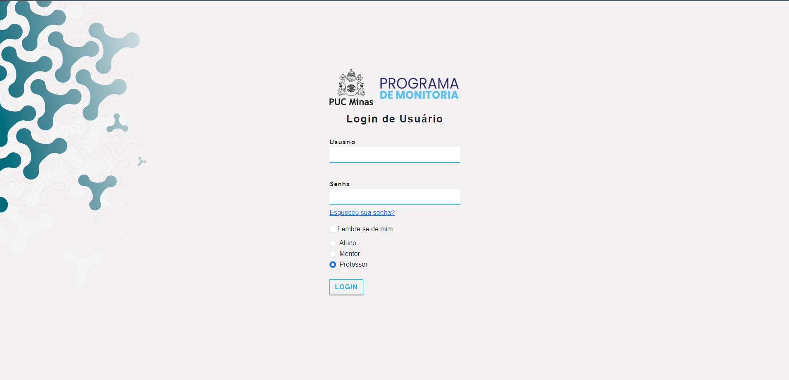

# Informações do Projeto 

DESENVOLVIMENTO DE UM SOFTWARE WEB PARA GERENCIAMENTO DE MONITORIAS DA PUC MINAS

Faculdades: Sistemas de Informação e Análise e Desenvolvimento de Sistemas

## Participantes

Desenvolvedores: 

Adenilson Rodrigues Cordeiro Junior

Arthur Alves Oliveira Silva

Alessandro Gomes Pereira

Marlon Magalhaes Carvalho

Samuel Correia Nunes

# Estrutura do Documento

- [Informações do Projeto](#informações-do-projeto)
  - [Participantes](#participantes)
- [Estrutura do Documento](#estrutura-do-documento)
- [Introdução](#introdução)
  - [Problema](#problema)
  - [Objetivos](#objetivos)
  - [Justificativa](#justificativa)
  - [Público-Alvo](#público-alvo)
- [Especificações do Projeto](#especificações-do-projeto)
  - [Personas e Mapas de Empatia](#personas-e-mapas-de-empatia)
  - [Histórias de Usuários](#histórias-de-usuários)
  - [Requisitos](#requisitos)
    - [Requisitos Funcionais](#requisitos-funcionais)
    - [Requisitos não Funcionais](#requisitos-não-funcionais)
  - [Restrições](#restrições)
- [Projeto de Interface](#projeto-de-interface)
  - [User Flow](#user-flow)
  - [Wireframes](#wireframes)
- [Metodologia](#metodologia)
  - [Divisão de Papéis](#divisão-de-papéis)
  - [Ferramentas](#ferramentas)
  - [Controle de Versão](#controle-de-versão)
- [**############## SPRINT 1 ACABA AQUI #############**](#-sprint-1-acaba-aqui-)
- [Projeto da Solução](#projeto-da-solução)
  - [Tecnologias Utilizadas](#tecnologias-utilizadas)
  - [Arquitetura da solução](#arquitetura-da-solução)
- [Avaliação da Aplicação](#avaliação-da-aplicação)
  - [Plano de Testes](#plano-de-testes)
  - [Ferramentas de Testes (Opcional)](#ferramentas-de-testes-opcional)
  - [Registros de Testes](#registros-de-testes)
- [Referências](#referências)

# Introdução

## Problema
  Para muitos estudantes, a busca por orientação ou monitoria pode ser dificultada por equívocos e desafios significativos. Algumas pessoas encaram essa busca como um sinal de vulnerabilidade ou falta de competência, o que acaba por desencorajá-las a procurar monitores. Além disso, estudantes universitários frequentemente enfrentam uma carga horária intensa, equilibrando aulas e trabalho, o que gera uma sensação de sobrecarga e falta de tempo para se envolver na busca por um monitor. A dificuldade em coordenar agendas também é um obstáculo adicional, especialmente quando os monitores em potencial também estão sobrecarregados com suas próprias obrigações acadêmicas e profissionais.

  Nesse cenário desafiador, a sincronização das agendas dos alunos com as dos monitores torna-se uma tarefa complicada, frequentemente desencorajando a busca por monitoria. No entanto, é importante reconhecer que esses obstáculos não deveriam impedir os estudantes de buscar orientação. Apesar das dificuldades, os benefícios que a monitoria pode oferecer em suas jornadas acadêmicas e profissionais são imensuráveis. Portanto, é fundamental superar esses desafios, procurando ativamente monitores que possam oferecer orientação valiosa.

## Objetivos

Desenvolver um software web voltado para a gestão do processo de aprendizado entre monitores e monitorados, com foco na facilitação da comunicação entre ambas as partes, incluindo a seleção do monitor e a definição dos tópicos a serem abordados durante a monitoria.

Objetivos Específicos:
Este projeto se propõe a alcançar os seguintes objetivos:

- Realizar uma pesquisa preliminar para identificar e definir os desafios associados ao processo de monitoria.
- Conduzir uma análise detalhada da documentação de requisitos, visando a identificação dos elementos cruciais para a criação do software.
- Criar uma aplicação web que permita a marcação e administração de sessões de monitoria por meio de módulos e funcionalidades específicas.
- Utilizar técnicas de desenvolvimento web para a construção da interface e layout da plataforma, garantindo também a implementação das funcionalidades necessárias.

Deste modo, nosso objetivo é desenvolver um software web que facilite eficazmente a gestão do processo de monitoria, promovendo a interação entre monitor e monitorado, ao mesmo tempo em que simplifica a escolha do monitor e a definição dos temas a serem abordados durante as sessões.

## Justificativa

  O software monitoria foi concebido com o propósito fundamental de revolucionar a interação entre os alunos e monitores da PUC Minas, com o objetivo primordial de simplificar e aprimorar substancialmente o canal de comunicação entre esses dois grupos, visando proporcionar uma experiência global aprimorada. Apesar de a plataforma CANVAS já oferecer a funcionalidade de monitoria, o atual modelo não está plenamente alinhado com as necessidades dos usuários que buscam especificamente esse tipo de interação. Nesse contexto, essa questão adquire grande relevância, especialmente para os alunos ingressantes da universidade, que frequentemente não estão familiarizados com o funcionamento detalhado do CANVAS e do SGA, o que resulta em desconhecimento e limitações na sua utilização eficiente.

  A implementação dessas melhorias não apenas beneficiará os alunos, proporcionando-lhes uma experiência mais suave e produtiva, mas também terá impactos positivos significativos para os monitores, contribuindo para a otimização e aprimoramento da eficácia do processo para todas as partes envolvidas permitindo a ambos novas funcionalidades para a melhor condução do processo de monitoria.

## Público-Alvo

O software web de monitorias para instituições educacionais atende a diversos públicos, incluindo:

- Professores e Orientadores: Utilizam a plataforma para fornecer suporte acadêmico e orientação aos estudantes.
- Alunos: Acessam a ferramenta para aprimorar seu desempenho acadêmico e planejar suas sessões de monitoria.
- Coordenadores Educacionais: Responsáveis pela supervisão de diversas atividades, incluindo as monitorias, contam com o software para gerenciar esses processos de forma eficiente.
- Administração Escolar: Os membros da equipe administrativa utilizam a plataforma para garantir o funcionamento adequado de todas as operações relacionadas às monitorias e à gestão geral da instituição.
 
# Especificações do Projeto

## Personas e Mapas de Empatia

## Histórias de Usuários
--------------------------------------------------------------------------------------------------------------------
Maria Gabriela Amorim é estudante do curso de Psicologia na PUC Minas e leva uma vida extremamente ocupada. Ela enfrenta desafios consideráveis na tentativa de equilibrar seus horários de estudo com seus compromissos pessoais e profissionais. Durante nossa entrevista, ela destacou a dificuldade que enfrenta ao buscar suporte para as disciplinas em que encontra obstáculos. Isso ocorre, em grande parte, devido à maioria das sessões de monitoria ocorrerem durante as tardes e, frequentemente, de forma presencial. No entanto, devido à sua residência distante e ao seu estágio em uma grande empresa, Gabriela não tem a flexibilidade de comparecer a essas monitorias.
Ela está ansiosa por uma solução que lhe permita harmonizar sua agenda com a disponibilidade das monitorias de forma híbrida, o que significa que ela gostaria de poder escolher entre participar presencialmente em alguns dias e remotamente em outros, conforme sua situação e necessidades específicas.

--------------------------------------------------------------------------------------------------------------------
Mateus Júnior Prado é um estudante dedicado do curso de Sistemas de Informação na PUC Minas. Desde o início de sua jornada acadêmica, ele traçou com clareza seus objetivos: tornar-se um programador habilidoso e, eventualmente, alcançar o sucesso como desenvolvedor de software. No entanto, Mateus compreendia que a estrada para atingir esses objetivos seria longa e repleta de desafios. Um dos obstáculos que ele enfrentou desde o início de sua trajetória foi a necessidade de orientação e monitoria.
Ele reconhecia a importância de aprender com aqueles que já trilharam o caminho que ele desejava seguir, mas deparava-se com a constante dificuldade de encontrar monitores e agendar sessões de monitoria que se encaixassem em sua agenda lotada de aulas e projetos. Determinado a superar esse obstáculo, Mateus começou a buscar métodos ágeis e flexíveis para programar e realizar suas monitorias. Ele percebeu que o mundo digital oferece uma infinidade de soluções e estava decidido a aproveitar ao máximo esses recursos.

--------------------------------------------------------------------------------------------------------------------
Rafaela Alves Santos é estudante do curso de Farmácia na PUC Minas. Ela tem a necessidade de entrar em contato com a monitoria da universidade de maneira ágil e eficiente. Seu objetivo é escolher as disciplinas que requerem sua maior atenção. Essa busca por agilidade e facilidade no acesso ao sistema de monitoria tem como finalidade principal auxiliá-la nos estudos das matérias em que enfrenta maiores dificuldades. Ela tem o desejo em economizar tempo e melhorar seu desempenho acadêmico, aproveitando da oportunidade para esclarecer dúvidas com os monitores, tornando seu processo de aprendizado mais eficaz.

--------------------------------------------------------------------------------------------------------------------

Com base nas análises das personas e nos mapas de empatia, foram identificados os seguintes pontos a serem desenvolvidos:

|MARIA GABRIELA      | QUERO/PRECISO                            |PARA                                                  |
|--------------------|------------------------------------------|------------------------------------------------------|
|Usuário do sistema  | Agendar as monitorias                     | Conciliar as agendas                                 |
|Usuário do sistema  | monitorias na modalidade Remota/Presencial| Flexibilidade de atendimento                         |

|MATEUS JUNIOR       | QUERO/PRECISO                            |PARA                                                  |
|--------------------|------------------------------------------|------------------------------------------------------|
|Usuário do sistema  | Agendar as monitorias                     | Conciliar as agendas                                 |
|Usuário do sistema  | monitorias na modalidade Remota/Presencial| Flexibilidade de atendimento                         |
|Usuário do sistema  | Sistema de Feedback                      | Criticas em relação as disponibilidades dos monitores |

|RAFAELA ALVES       | QUERO/PRECISO                            |PARA                                                  |
|--------------------|------------------------------------------|------------------------------------------------------|
|Usuário do sistema  | Agendar as monitorias                     | Conciliar as agendas                                 |
|Usuário do sistema  | Comunicar com o monitor                   | Sanar duvidas                                        |
|Usuário do sistema  | monitorias na modalidade Remota/Presencial| Flexibilidade de atendimento                         |
|Usuário do sistema  | Sistema de Feedback                      | Criticas em relação as disponibilidades dos monitores |
|Usuário do sistema  | Suporte ao Sistema                       | Auxiliar na utilização do novo sistema               |

## Requisitos

As tabelas subsequentes exibem os requisitos funcionais e não funcionais que proporcionam uma descrição detalhada do escopo do projeto.

### Requisitos Funcionais

|ID    | Descrição do Requisito  | Prioridade |
|------|-----------------------------------------|----|
|RF-001| O sistema deve ter um banco de dados de alunos e monitores | ALTA |
|RF-002| Permitir o cadastro das disciplinas  | ALTA |
|RF-003| Disponibilizar agenda para marcação de horários com monitores | ALTA |
|RF-004| Sistema de Mensagem para comunicação entre monitor e Aluno | ALTA |
|RF-005| O sistema deve permitir a entrada por Login e Senha | ALTA |
|RF-006| Compartilhamento de Recursos e Matérias Complementares | MÉDIO |
|RF-007| O sistema deve possuir encaminhamento para sites que possibilitem o Feedback dos alunos| BAIXO |

### Requisitos não Funcionais

|ID     | Descrição do Requisito  |Prioridade |
|-------|-------------------------|----|
|RNF-001| O sistema deve ser capaz de ser escalavel | ALTA | 
|RNF-002| O sistema deve possuir medidas de segurança visando a privacidade dos dados  | ALTA | 
|RNF-003| O sistema deve ser robusto o suficiente para suportar simultaneamente múltiplos usuários.| ALTA | 
|RNF-004| O sistema deve ser responsivo para rodar em um dispositivos móvel  | MÉDIA | 
|RNF-005| O sistema deve possuir Backup planejado dos dados  | MÉDIA | 
|RNF-006| O sistema deve possuir suporte tecnico quando necessario | MÉDIA | 
|RNF-007| O sistema deve estar disponível 99,9% do tempo, sem interrupções, excluindo janelas de manutenção planejada. | BAIXO | 

## Restrições

O projeto está limitado pelos elementos apresentados na tabela a seguir.

|ID| Restrição                                             |
|--|-------------------------------------------------------|
|01| O sistema web será desenvolvido visando apenas desktops.|
|02| O projeto deverá ser concluído até o final do semestre letivo.|
|03| O projeto possui 5 desenvolvedores.|
|04| Restrições orçamentárias e financeiras.|
|05| O sistema deverá ser desenvolvido em JavaScript.|
|06| O sistema deve ser desenvolvido em língua portuguesa.|

# Projeto de Interface

Estas soluções foram minuciosamente planejadas com o objetivo de proporcionar uma experiência completa e eficaz aos usuários. Um elemento essencial do nosso site será a incorporação de um sistema de mensagem que permitirá a interação direta entre os usuários e os monitores. Isso simplificará a troca eficaz de informações e experiências, possibilitando que os usuários esclareçam dúvidas, recebam orientações e estabeleçam conexões mais próximas com os monitores, enriquecendo assim o processo de monitoria.

Ademais, o site incluirá uma funcionalidade de agendamento que permitirá aos monitores marcar sessões de monitoria de acordo com sua disponibilidade. Essa funcionalidade aprimorará a gestão do tempo, assegurando uma organização eficiente das agendas e proporcionando transparência na disponibilidade dos monitores.

Um recurso valioso será a integração de um fórum no site, onde os usuários poderão compartilhar suas experiências, fazer perguntas e colaborar uns com os outros. Esse espaço comunitário promoverá a colaboração e a troca de conhecimento entre os usuários, enriquecendo ainda mais a experiência educacional.

Por fim, nosso site incluirá uma aba dedicada à inclusão de listas de atividades, vídeos e materiais complementares disponibilizados pelos monitores. Além disso, o site também contará com uma página dedicada ao feedback. Isso permitirá que os usuários realizem tarefas e avaliem tanto os monitores quanto o conteúdo disponibilizado. Essa abordagem não apenas incentivará a participação ativa, mas também possibilitará o aprimoramento contínuo do programa de monitoria com base nos comentários dos usuários.

## User Flow

## Wireframes
. Tela: Login.

. Tela: Painel do Aluno.

. Tela: Painel do Monitor.

. Tela: Conteúdo das Disciplinas.

. Tela: Agendamento.

. Tela: Mensagens.

. Tela: Ajuda.

. Tela: Configurações.

# Metodologia

A metodologia adotada pelo nosso grupo para o desenvolvimento deste projeto baseou-se nas práticas ágeis, uma abordagem que valoriza a flexibilidade, a colaboração e a entrega contínua. Optamos por utilizar o Scrum, um dos métodos ágeis mais reconhecidos, para guiar nosso processo de trabalho. 
A metodologia enfatiza a entrega incremental, permitindo que as funcionalidades do projeto sejam desenvolvidas e disponibilizadas em ciclos curtos, conhecidos como sprints. Cada sprint teve uma duração fixa, proporcionando oportunidades frequentes de revisão e adaptação do trabalho realizado. 
Para facilitar a comunicação e colaboração, utilizamos ferramentas colaborativas, como o discord para comunicação em tempo real e o Trello para gerenciar as tarefas em um formato visual e interativo. Essas ferramentas foram essenciais para manter todos os membros da equipe alinhados com os objetivos e progressos do projeto. 

## Divisão de Papéis

A equipe foi dividida em papéis distintos, cada membro contribuindo para o desenvolvimento do projeto de maneira específica. Abaixo estão detalhadas as responsabilidades e realizações de cada integrante:

Adenilson:
Alinhou os cards do Painel de Controle.
Uniformizou o tamanho das imagens da capa do álbum.
Reduziu e otimizou os nomes das páginas do projeto.
Aprimorou a estilização da Página de Conteúdo com ícones e fontes.
Desenvolveu um Novo Painel do Monitor no Estilo de Postagem de Blog.
Criou botões exclusivos para o Monitor/Professor, permitindo apagar o conteúdo postado semanalmente e editar.

Alessandro:
Adicionou os novos inputs da Página Calendário ao Calendário.
Desenvolveu um botão para o envio de imagens da capa dos cards/configuração.
Incluiu botões de alternância Light/Dark na agenda.
Integrado o calendário dentro de um container Bootstrap para garantir responsividade.
Realizou a limpeza do código da página desenvolvida.

Arthur:
Verificou a responsividade da tela desenvolvida.
Corrigiu o botão "Voltar" na Página dos Conteúdos das Disciplinas.
Garantiu que todas as páginas estão linkadas corretamente.
Melhorou e corrigiu o conteúdo das páginas, removendo informações desnecessárias.
Corrigiu nomes e e-mails na página de pessoas.
Adicionou um link na página de ajuda para os contatos da PUC.

Marlon:
Vinculou no código a imagem "Fale com a PUC Minas" com o site oficial da PUC Minas.
Desenvolveu páginas de Caixa de Saída, Importantes e Lixeira.
Garantiu a correta vinculação de todas as páginas.
Realizou uma revisão geral do trabalho, verificando responsividade, conexões, links, comunicação e GitHub.
Supervisionou a equipe para as entregas dentro do prazo estabelecido.

Samuel:
Desenvolveu o botão "Sair" para todas as páginas.
Inseriu ícones na página de ajuda para cada opção.
Verificou a responsividade do Menu Lateral das páginas.
Realizou a limpeza do código em todas as páginas.
Desenvolveu a página do monitor, incluindo a barra lateral.
Coordenou a equipe em direção às metas e sprints.
Foi responsável por corrigir erros, códigos, documentos e assegurou a qualidade do trabalho em cada sprint.

## Ferramentas

No processo de desenvolvimento de um software web voltado para a gestão de processo de aprendizado entre monitores e monitorados, diversas ferramentas desempenharam papéis cruciais. Cada uma delas contribuiu para diferentes aspectos do ciclo de vida do software, desde o planejamento até a entrega final. Abaixo, destacamos as principais ferramentas utilizadas e suas respectivas usabilidades e vantagens:

Trello - Controle de Demandas e Gerenciamento de Projeto:

O Trello é uma ferramenta de gerenciamento de projetos baseada em quadros, listas e cartões. Cada cartão representa uma tarefa ou demanda, e as listas organizam essas tarefas em diferentes estágios do projeto, isso facilita a visualização do fluxo de trabalho, permite atribuir responsabilidades a membros da equipe, acompanhar o progresso em tempo real e identificar possíveis gargalos. Além disso, sua interface intuitiva promove a colaboração eficiente entre os membros da equipe.

VSCode - Desenvolvimento de HTML5, CSS e JS (JavaScript):

Visual Studio Code (VSCode) é um ambiente de des’envolvimento integrado leve e poderoso. Suporta uma ampla gama de linguagens de programação, oferecendo recursos avançados como realce de sintaxe, depuração e controle de versão integrado. A eficiência do VSCode reside na sua extensibilidade e na integração perfeita com ferramentas populares. Oferece sugestões inteligentes de código, facilita a navegação no projeto e proporciona uma experiência de desenvolvimento fluida.

Discord - Reuniões de Alinhamento:

Discord é uma plataforma de comunicação por voz, vídeo e texto. Foi utilizado para reuniões de alinhamento entre os membros da equipe, proporcionando uma comunicação rápida e eficaz. Foram realizadas reuniões síncronas, promovendo a interação instantânea entre os membros da equipe, facilita a comunicação informal e oferece recursos como compartilhamento de tela para apresentações mais claras.

GitHub - Controle de versão do software e repositório de documentação:

GitHub é uma plataforma de hospedagem de código-fonte que utiliza o sistema de controle de versão Git. Ele fornece um ambiente colaborativo para desenvolvedores compartilharem, colaborarem e controlarem as alterações em seu código. O repositório oferece um histórico detalhado de alterações no código, facilita a colaboração simultânea de várias equipes, fornece recursos de rastreamento de problemas (issues) e permite a integração contínua para garantir uma entrega contínua e estável.
Em conjunto, essas ferramentas criaram um ambiente de desenvolvimento integrado e colaborativo. O Trello ajudou na organização das tarefas, o VSCode facilitou o desenvolvimento do código, o Discord promoveu a comunicação eficiente, e o GitHub garantiu o controle de versão e a gestão centralizada do código-fonte.

| Ambiente  | Plataforma              |Link de Acesso |
|-----------|-------------------------|---------------|
|Gerenciamento de projeto  | Trello |  https://trello.com/ | 
|Repositório de código | GitHub | https://gist.github.com/ | 
|Ambiente de desenvolvimento | VScode |  https://code.visualstudio.com/ | 
|Reuniões de alinhamento | Discord | https://discord.com/ | 

## Controle de Versão

O controle de versão é uma parte essencial do desenvolvimento de software, e o GitHub emergiu como uma plataforma central nesse processo, oferecendo inúmeras vantagens para desenvolvedores individuais e equipes. Sua importância transcende a simples hospedagem de código, desempenhando um papel fundamental em promover a colaboração, garantir a integridade do código e facilitar o desenvolvimento iterativo. As seguintes funcionalidades foram utilizadas no processo de desenvolvimento do projeto:

  1.	Branches:
•	Master: A branch "master" é utilizada para armazenar versões estáveis e testadas do software. É a versão que está pronta para produção.
•	Unstable: A branch "unstable" contém versões testadas, mas que ainda podem apresentar instabilidades. É uma etapa intermediária antes da versão estável.
•	Testing: A branch "testing" é destinada a versões em processo de teste. Aqui, as funcionalidades são agrupadas para verificar sua estabilidade antes de passar para a branch "unstable" ou "master".
•	Dev: A branch "dev" é a versão de desenvolvimento, onde as novas funcionalidades são integradas e testadas continuamente.
  2.	Commits:
•	Cada commit no repositório representa uma alteração específica no código.
•	Commits são feitos de forma atômica, abordando uma única funcionalidade ou correção por vez.
•	Mensagens de commit são claras e informativas, seguindo as melhores práticas de commit messages.
  3.	Merges:
•	Merges são realizados conforme as funcionalidades são desenvolvidas e testadas com sucesso na branch "dev".
•	Integrações de branches ocorrem regularmente para evitar conflitos e manter um fluxo contínuo de desenvolvimento.
•	Merges para branches de teste e instável são realizados apenas após testes completos e aprovação.
  4.	Tags:
•	Tags são usadas para marcar versões específicas do software, especialmente aquelas que são lançadas para produção.
•	Cada tag é nomeada de acordo com a versão correspondente para fácil referência.

Gerência de Issues: Convenção de Etiquetas
  1.	Bugfix:
•	Issues rotuladas como "bugfix" indicam problemas em funcionalidades existentes que precisam ser corrigidos.
•	A equipe prioriza e aborda esses problemas de forma eficiente, realizando os devidos testes antes de fazer os merges.
  2.	Enhancement:
•	Issues rotuladas como "enhancement" indicam áreas de funcionalidades existentes que precisam ser aprimoradas.
•	As melhorias propostas são discutidas e implementadas na branch de desenvolvimento, passando por testes adequados.
  3.	Feature:
•	Issues rotuladas como "feature" representam a introdução de novas funcionalidades.
•	As novas funcionalidades são desenvolvidas na branch de desenvolvimento ("dev") e integradas de acordo com o fluxo estabelecido.

Essa estrutura e convenção de nomenclatura proporcionam uma organização clara e eficiente no desenvolvimento do software, permitindo uma gestão robusta e controlada do ciclo de vida do projeto, desde o desenvolvimento até a entrega estável em produção. O GitHub, como plataforma de hospedagem, facilita a colaboração entre membros da equipe, o rastreamento de mudanças e o gerenciamento de problemas, tornando o processo mais transparente e eficaz.

# Projeto da Solução

......  COLOQUE AQUI O SEU TEXTO ......

## Tecnologias Utilizadas

No decorrer do desenvolvimento deste projeto, tornou-se imprescindível a criação de códigos HTML (Hypertext Markup Language), cuja finalidade é possibilitar que o navegador interprete e exiba as marcações de texto e outros elementos de mídia em uma página web. Essa abordagem visa viabilizar uma interação eficaz do usuário com o conteúdo disponibilizado.

O papel crucial desempenhado pelo desenvolvimento do código CSS (Cascading Style Sheets) concentrou-se na estilização do site, resultando em uma interface de navegação mais atraente e amigável ao usuário. Isso elevou significativamente a experiência de utilização para um nível mais sofisticado e agradável.

Vale ressaltar que foi necessário empregar o framework front-end Bootstrap, que oferece estruturas de CSS para a criação de sites e aplicações responsivas de maneira ágil e simplificada. Este framework contribuiu de maneira significativa para a eficiência e a estética do projeto.

No âmbito deste trabalho, a linguagem de programação JavaScript desempenhou um papel fundamental. Ela permitiu a criação de funções dinâmicas que aprimoraram a experiência do usuário durante a interação com o site. Além disso, por meio do JavaScript, foi possível manipular objetos e elementos, viabilizando o funcionamento de partes específicas do programa. Essa versatilidade e capacidade de interação dinâmica foram elementos-chave na implementação bem-sucedida do projeto.

O jQuery desempenhou um papel essencial no desenvolvimento da página web, proporcionando uma série de funções que auxiliam os programadores a escrever de maneira mais rápida e dinâmica o DOM (Document Object Model), sem a necessidade de criar o código completo em JavaScript. Essa ferramenta simplifica tarefas comuns, oferecendo uma abstração eficaz sobre as complexidades do JavaScript puro, o que resulta em um desenvolvimento mais eficiente e produtivo. Ao utilizar o jQuery, foi possível otimizar o processo de manipulação e interação com os elementos da página, contribuindo para uma experiência de usuário mais fluida e agradável.

Para aprimorar a estilização do site, optou-se por incorporar a biblioteca de ícones do FontAwesome. Essa escolha permitiu enriquecer visualmente o design, proporcionando uma ampla variedade de ícones que foram facilmente integrados às diferentes partes do site. A utilização da biblioteca FontAwesome não apenas aprimorou a estética geral, mas também contribuiu para uma experiência de usuário mais intuitiva e visualmente atraente, enriquecendo a representação gráfica dos elementos presentes na página.

**A seguir, apresentamos as primeiras versões iniciais do sistema:**

Este constitui o primeiro esboço da tela do painel do usuário, onde inicialmente concebemos a ideia de integrar todas as funcionalidades do site em uma única tela. Entretanto, essa abordagem logo se mostrou inviável devido à complexidade do projeto.

> Descreva aqui qual(is) tecnologias você vai usar para resolver o seu
> problema, ou seja, implementar a sua solução. Liste todas as
> tecnologias envolvidas, linguagens a serem utilizadas, serviços web,
> frameworks, bibliotecas, IDEs de desenvolvimento, e ferramentas.
> Apresente também uma figura explicando como as tecnologias estão
> relacionadas ou como uma interação do usuário com o sistema vai ser
> conduzida, por onde ela passa até retornar uma resposta ao usuário.
> 
> Inclua os diagramas de User Flow, esboços criados pelo grupo
> (stoyboards), além dos protótipos de telas (wireframes). Descreva cada
> item textualmente comentando e complementando o que está apresentado
> nas imagens.

## Arquitetura da solução

......  COLOQUE AQUI O SEU TEXTO E O DIAGRAMA DE ARQUITETURA .......

> Inclua um diagrama da solução e descreva os módulos e as tecnologias
> que fazem parte da solução. Discorra sobre o diagrama.
> 
> **Exemplo do diagrama de Arquitetura**:
> 
> 

# Avaliação da Aplicação

......  COLOQUE AQUI O SEU TEXTO ......

> Apresente os cenários de testes utilizados na realização dos testes da
> sua aplicação. Escolha cenários de testes que demonstrem os requisitos
> sendo satisfeitos.

## Plano de Testes

......  COLOQUE AQUI O SEU TEXTO ......

> Enumere quais cenários de testes foram selecionados para teste. Neste
> tópico o grupo deve detalhar quais funcionalidades avaliadas, o grupo
> de usuários que foi escolhido para participar do teste e as
> ferramentas utilizadas.
> 
> **Links Úteis**:
> - [IBM - Criação e Geração de Planos de Teste](https://www.ibm.com/developerworks/br/local/rational/criacao_geracao_planos_testes_software/index.html)
> - [Práticas e Técnicas de Testes Ágeis](http://assiste.serpro.gov.br/serproagil/Apresenta/slides.pdf)
> -  [Teste de Software: Conceitos e tipos de testes](https://blog.onedaytesting.com.br/teste-de-software/)

## Ferramentas de Testes (Opcional)

......  COLOQUE AQUI O SEU TEXTO ......

> Comente sobre as ferramentas de testes utilizadas.
> 
> **Links Úteis**:
> - [Ferramentas de Test para Java Script](https://geekflare.com/javascript-unit-testing/)
> - [UX Tools](https://uxdesign.cc/ux-user-research-and-user-testing-tools-2d339d379dc7)

## Registros de Testes

......  COLOQUE AQUI O SEU TEXTO ......

> Discorra sobre os resultados do teste. Ressaltando pontos fortes e
> fracos identificados na solução. Comente como o grupo pretende atacar
> esses pontos nas próximas iterações. Apresente as falhas detectadas e
> as melhorias geradas a partir dos resultados obtidos nos testes.

# Referências

......  COLOQUE AQUI O SEU TEXTO ......

> Inclua todas as referências (livros, artigos, sites, etc) utilizados
> no desenvolvimento do trabalho.
> 
> **Links Úteis**:
> - [Formato ABNT](https://www.normastecnicas.com/abnt/trabalhos-academicos/referencias/)
> - [Referências Bibliográficas da ABNT](https://comunidade.rockcontent.com/referencia-bibliografica-abnt/)
